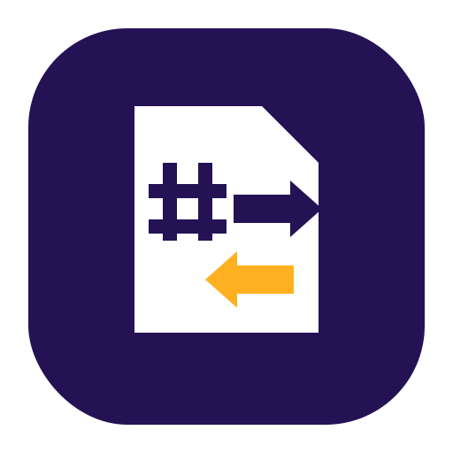
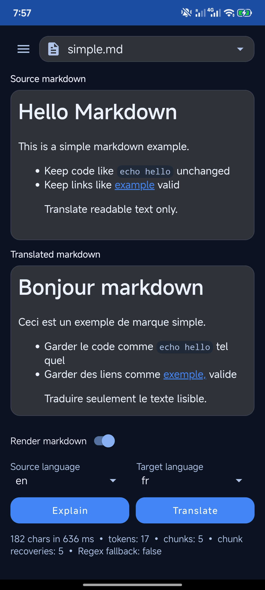

# ML Kit Markdown Translator



## Example App Screenshot



Reusable Android library for translating Markdown content with Google ML Kit while preserving Markdown structure (code blocks, links, headings, lists, and spacing) as much as possible.

## Project status

Active development with versioned releases via Git tags.

## Planned modules

- `library/` — Android library module (core deliverable)
- `sample/` — Android sample app for manual verification
- `docs/` — design notes and API documentation

## Build the Example App

From repo root:

```bash
./gradlew :sample:assembleDebug
```

Generated APK:

```text
sample/build/outputs/apk/debug/sample-debug.apk
```

Optional install to a connected device:

```bash
adb install -r sample/build/outputs/apk/debug/sample-debug.apk
```

## API reference

See [`docs/api.md`](docs/api.md) for the current public API surface.

## Architecture

See [`docs/architecture.md`](docs/architecture.md) for the markdown translation architecture and pipeline design.

## Installation

### Option A: Local module

If this repository is part of your multi-module build, use:

```gradle
dependencies {
    implementation project(":library")
}
```

### Option B: JitPack (`0.9.7`)

JitPack page: https://jitpack.io/#godsarmy/mlkit-markdown-translator-android

```gradle
repositories {
    google()
    mavenCentral()
    maven { url "https://jitpack.io" }
}

dependencies {
    implementation "com.github.godsarmy:mlkit-markdown-translator-android:0.9.7"
}
```

Kotlin DSL equivalent:

```kotlin
repositories {
    google()
    mavenCentral()
    maven("https://jitpack.io")
}

dependencies {
    implementation("com.github.godsarmy:mlkit-markdown-translator-android:0.9.7")
}
```

### Version alignment (optional)

This library defaults to:

- `com.google.mlkit:translate:17.0.3`
- `com.vladsch.flexmark:flexmark:0.64.8`

If integrating this repo as a **local module**, override in root `gradle.properties`:

```properties
mlkitTranslateVersion=17.0.4
flexmarkVersion=0.64.8
```

If integrating via **JitPack/artifact**, pin ML Kit in app dependencies:

```gradle
dependencies {
    implementation "com.github.godsarmy:mlkit-markdown-translator-android:0.9.7"
    implementation "com.google.mlkit:translate:17.0.4"
}
```

## Using from Android app

### 1) Basic translation call

```java
MlKitMarkdownTranslator translator = new MlKitMarkdownTranslator();

translator.translateMarkdown(markdown, "en", "es", new TranslationCallback() {
    @Override
    public void onSuccess(String translatedText) {
        // update UI / state with translated markdown
    }

    @Override
    public void onFailure(Exception error) {
        // handle translation failure
    }
});
```

### 1.1) Explain markdown structure/chunks

```java
import io.github.godsarmy.mlmarkdown.api.ExplainMarkdownChunk;
import io.github.godsarmy.mlmarkdown.api.ExplainMarkdownResult;

MlKitMarkdownTranslator translator = new MlKitMarkdownTranslator();
ExplainMarkdownResult explain = translator.explainMarkdown(markdown);

// Useful for debugging chunk boundaries and tokenization behavior.
for (ExplainMarkdownChunk chunk : explain.getChunks()) {
    Log.d("MLMD", "chunk #" + chunk.getIndex() + " raw=" + chunk.getRawText());
}

Log.d("MLMD", "mode=" + explain.getProcessingMode()
        + " tokens=" + explain.getTotalTokenCount()
        + " chunks=" + explain.getTotalChunkCount());
```

`explainMarkdown(...)` runs local preparation/chunking diagnostics and does not call the
translation engine.

### 2) Handle missing-model errors

```java
import io.github.godsarmy.mlmarkdown.api.TranslationErrorCode;
import io.github.godsarmy.mlmarkdown.api.TranslationException;

if (error instanceof TranslationException
        && ((TranslationException) error).getCode() == TranslationErrorCode.MODEL_NOT_DOWNLOADED) {
    // prompt user to download required language model first
}
```

### 3) Manage model lifecycle in app code (native ML Kit)

Use native ML Kit APIs in your app for model download/list/delete:

- `RemoteModelManager`
- `TranslateRemoteModel`
- `DownloadConditions`

`translateMarkdown(...)` does not auto-download missing models.

### 4) Recommended app structure

- **Activity/Fragment**: owns UI state and triggers user actions.
- **ViewModel**: coordinates source/target language + intent handling.
- **Repository**: wraps `MlKitMarkdownTranslator.translateMarkdown(...)`.
- **App model manager**: wraps ML Kit model lifecycle APIs.

Example repository-style wrapper:

- `docs/examples/JavaMarkdownTranslationRepositoryExample.java`

### 5) Integration guardrails

- **Android SDK**: library targets `minSdk 24`, `compileSdk 34`.
- **Permissions**: include internet permission when model downloads are expected:

  ```xml
  <uses-permission android:name="android.permission.INTERNET" />
  ```

- **Threading**: callbacks are async; post UI updates to main thread.
- **Resource lifecycle**:
  - create one translator instance per screen/controller scope
  - call `close()` in `onDestroy()` (or equivalent)
  - avoid creating new translator instances per click
- **R8/ProGuard**: no custom keep rules required for current public API surface.

## Limitations (v1)

This library is designed to preserve Markdown structure during translation, but v1 still has known limits:

- advanced nested Markdown edge cases may not be perfectly preserved
- raw HTML blocks beyond currently supported patterns may not round-trip cleanly
- GFM-style pipe tables are supported in AST path; regex fallback may preserve full table blocks without translating each cell
- reference-style link definitions may be imperfect if tokenization does not fully cover a case
- translator-driven punctuation drift can still occur in plain text regions

For production use, validate your own Markdown fixtures with the provided golden-test pattern under
`library/src/test/resources/fixtures`.

## License

Apache License 2.0. See `LICENSE`.
